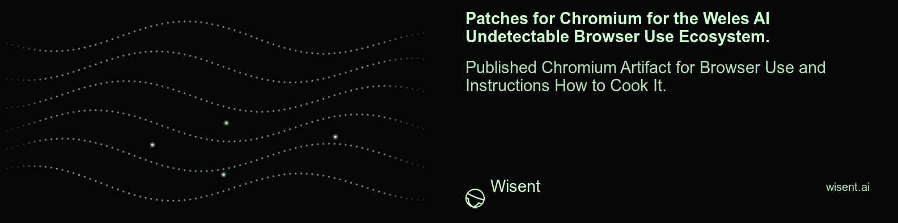

<!-- wisent-banner:start -->
<p align="center">
  
</p>
<!-- wisent-banner:end -->

<!-- wisent-readme-signals:start -->
[](https://github.com/wisent-ai/weles-chromium) [](https://github.com/wisent-ai/weles-chromium/issues) [](https://wisent.com) [](https://discord.gg/qRjpkthq54) [](https://www.linkedin.com/company/wisent-ai/) [](https://x.com/wisentai) [](https://calendly.com/lbartoszcze)
<!-- wisent-readme-signals:end -->

# Patches for Chromium for the Weles AI Undetectable Browser Use Ecosystem

Published Chromium Artifact for Browser Use and Instructions How to Cook It.

This repository carries the Chromium patches, build instructions,
verification, and artifact-publishing process used by Weles. It is parallel to
[`wisent-ai/weles-firefox`](https://github.com/wisent-ai/weles-firefox).

This repository is the source of truth for the C++ delta and the release
contract. It does not vendor the Chromium checkout; it carries only the patches
that apply on top of a pinned upstream.

## Upstream base

| | |
|---|---|
| Upstream version | **147.0.7727.108** |
| Fork point (patch base) | `e74a8f5bfafeb` (last upstream commit before the weles series) |
| Local working branch | `weles-147` in `chromium-build/src` |

Bump the upstream version + fork point together on a rebase, and re-export the
series (see "Re-exporting" below).

## What the patches do

Every override is **opt-in at launch via `--weles-fingerprint=<json>`**. With
the switch unset, `WelesFingerprintConfig::Get()` returns `nullptr` and every
patched call site defers to stock Chromium — so an unflagged binary is a
drop-in upstream chrome. The JSON schema mirrors `weles.fingerprint.toCppConfig`
(TypeScript) → the C++ struct in `weles_fingerprint_config.h`.

| Patch | Surface |
|---|---|
| `0001-Weles-modifications-rebased-onto-Chromium-147...` | The bulk of the delta: new `third_party/blink/renderer/platform/weles_fingerprint_config.{cc,h}` singleton + `--weles-fingerprint` switch (`third_party/blink/common/switches.*`), and the call-site overrides — `navigator.*` (UA, platform, vendor, languages, hardwareConcurrency, deviceMemory), `screen.*`, WebGL `UNMASKED_VENDOR/RENDERER`, canvas noise removal (`image_data_buffer.cc`), WebAudio noise, WebRTC ICE IP override (`rtc_ice_candidate_platform.cc`), client hints `sec-ch-ua-*` (`user_agent_utils.cc`), locale, plus proxy-socket / network hardening and `chrome/renderer/webstore_extension_bindings.*`. |
| `0002-input_handler-backdate-CDP-event-timestamps-...` | Backdates CDP-routed input event timestamps and stamps realistic pointer pressure / `movementX/Y` provenance so dispatched input is indistinguishable from OS-queued input. |
| `0003-weles-remove-unreachable-code-in-PrepareForAuthResta...` | Cleanup in the proxy auth-restart path. |
| `0004-weles-wrap-canvas-noise-pixmap-access-in-UNSAFE_BUFF...` | Wraps the canvas-noise pixmap access in `UNSAFE_BUFFERS()` for the newer Chromium buffer-safety lint. |
| `0005-weles-drop-unused-cfg-binding-in-Navigator-webdriver...` | Trivial unused-binding cleanup in `Navigator::webdriver()`. |
| `0006-weles-stamp-movement_x-y-on-CDP-synthesized-mouse-ev...` | Stamps `movement_x/movement_y` on CDP-synthesized mouse events from the InputHandler's tracked previous position (sentinel so the first event reports movement 0, like a real mouse entering the window). CDP leaves these at 0 by default — the bot signature LinkedIn `/apfc/collect` and Arkose read. |
| `0007-weles-mirror-release-channel-behavior-for-3-dcheck_a...` | Neutralizes 3 `dcheck_always_on` aborts that fire during real automation where stock release Chromium silently continues: `AssertBlockingAllowed` (TikTok captcha WASM sync I/O), `TabStatsDataStore::OnWindowRemoved` (TikTok verify SDK popup-iframe counter underflow), `ToV8ContextMaybeEmpty` (Arkose/GitHub nav transient detached-frame context). Each mirrors release-channel behavior, not a blind bypass. |

## Applying

```bash
# Requires Git, jq and an existing upstream Chromium checkout:
bash apply.sh /path/to/chromium/src
```

The source must be the exact checkout root, with no tracked or untracked work
and no unfinished merge, rebase, cherry-pick, revert or patch application.
Admission refuses before changing source and names the observed state.
The script reads `forkPoint` from `browser-capabilities.json`, uses a non-forced
detached checkout and applies the series once with `git am --three-way`.
Existing branches are not reset. A failed patch application retains Git's
diagnostics and operation state; no automatic abort or second attempt hides it.

## Building and releasing

A release is a Stado release of product `weles-chromium`, declared in
`.wisent-release.json`; no script here publishes anything by hand:

```bash
stado release submit --source /path/to/weles-chromium --commit <pushed commit>
```

- **Version:** `upstreamVersion` in `browser-capabilities.json`, so the
  coordinate is `stado://releases/weles-chromium/<upstreamVersion>/darwin-arm64/release.tar.gz`.
- **Quality (`fmt`):** `release/quality.sh` parses every patch under `patches/`
  the way `git am` reads it and refuses an empty series.
- **Build:** `release/build.sh` runs on a darwin-arm64 builder that declares
  `WELES_CHROMIUM_SRC`, its own `chromium/src` checkout (the upstream tree is
  too large for any release to carry). It invokes the same `apply.sh` admission
  and patch operation, then builds `out/Weles chrome` and stages `Chromium.app`.
  A missing `WELES_CHROMIUM_SRC`, dirty or unfinished source, an unavailable
  fork point, or a build without `Chromium.app` is refused naming its cause.

Still open: no builder declares `WELES_CHROMIUM_SRC` yet, and the manifest
delivers to no host, so a Weles host installs the published archive itself.

### Source admission qualification

`tests/release/source_admission.rs` runs the real `apply.sh` against an explicitly
supplied dedicated Chromium checkout; it does not create a substitute repository.
Run from this product checkout with `WELES_CHROMIUM_TEST_SOURCE` naming that source:

```bash
mkdir -p .build
rustc --edition 2021 --test tests/release/source_admission.rs -o .build/source-admission-test
.build/source-admission-test --ignored --exact applies_real_patch_series
```

The successful flow verifies the declared fork ancestry, the complete patch
count, unchanged existing refs and a clean detached checkout. It leaves the
applied source available for the release build. Run `preserves_dirty_source`,
`preserves_unfinished_operation` and `refuses_nested_source` separately with
the corresponding real source state. Each refusal must name its cause and leave
HEAD, refs, tracked changes and untracked file contents unchanged.
Reports retain the product revision, input Git object hashes, command arguments,
exit statuses and observed state under `.build/source-admission`.
No browser compilation, installation or graphical qualification is implied.

## Re-exporting the series after new work

```bash
# In the admitted Chromium source after applying and committing changes:
git format-patch <fork-point>..HEAD -o /path/to/weles-chromium/patches --no-signature
```

Then update the upstream version and fork point in `browser-capabilities.json`
and push.